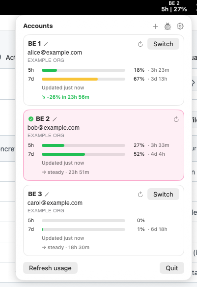

<div align="center">

# aimonitor

**適用於 macOS 與 Linux 的多帳戶 Claude Code 用量監控與靜默帳戶切換工具。**

[](https://github.com/japananh/aimonitor/actions/workflows/ci.yml)
[](LICENSE)
[](https://github.com/japananh/aimonitor/releases)

> [English](README.md) | [简体中文](README-zh.md) | **繁體中文** | [Tiếng Việt](README-vi.md)



</div>

## 功能特色

- 🔍 **每個帳戶的 5h + 7d 用量條** —— 取自 Anthropic 的 `/api/oauth/usage`（不消耗 token），並附趨勢列（`↗ +21% in 45m`）。
- 🔀 **靜默切換** —— `aimonitor switch <label>` 重新整理 OAuth token 並替換目前憑證。無需 `claude /login`，也不必切到終端機。
- 🤖 **自動切換**：當使用中的帳戶達到 5h *或* 7d 閾值（預設 80 %）時觸發 —— 選擇整體餘量最多的帳戶（兼顧兩個視窗），略過已用盡／被限流的帳戶；若使用中的帳戶達到 100 % 會立即切換。執行中的 `claude` 工作階段會自動跟隨。
- 🔔 **接近上限時通知**（在自動切換關閉時生效）。
- 💾 **匯出／匯入** 設定，或把帳戶遷移到另一台機器 —— 憑證為選用，並以密碼短語加密（Argon2id + AES-256-GCM）。
- 🔌 **MCP 伺服器** —— 透過 stdio 向 Claude Code 提供 28 個 Slack + ClickUp 工具，支援各服務的唯讀模式。
- 🔐 **存於系統鑰匙圈**（macOS Keychain、Linux libsecret）。SQLite 僅保存參照；token 不會離開鑰匙圈。無遙測。

## 安裝

```sh
# macOS (Sonoma 14+)
brew install --cask japananh/tap/aimonitor

# Linux (Ubuntu 22.04+) —— 僅 CLI
curl -fsSL https://raw.githubusercontent.com/japananh/aimonitor/main/packaging/linux/install.sh | sh

# 任意平台，僅 CLI
go install github.com/japananh/aimonitor/cmd/aimonitor@latest
```

> **未受信任的 tap：** 較新的 Homebrew 在你信任第三方 tap 之前會拒絕載入它。若安裝出現 *"Refusing to load cask … from untrusted tap"* 錯誤，執行 `brew trust japananh/tap` 後重試。

> **macOS 首次啟動：** `.app` 尚未公證 —— 清除一次 Gatekeeper 隔離：
> `xattr -dr com.apple.quarantine /Applications/AIMonitor.app`（或右鍵 → 打開）。見 [`docs/unsigned-app.md`](docs/unsigned-app.md)。

### 升級

```sh
brew upgrade --cask aimonitor   # macOS
aimonitor update check          # CLI：是否有新版本？
aimonitor update install        # CLI：背景升級
```

選單列 App 也會在啟動時檢查 GitHub，並在 **Preferences → Check for updates** 提示更新。預先發行版絕不會自動推送 —— `brew upgrade` 始終讓你停留在最新的穩定版。

## 快速開始

```sh
aimonitor add --adopt-current --label personal   # 註冊目前的 Claude 登入
aimonitor add --label work                        # 新增另一個帳戶（執行 claude /login，輪詢鑰匙圈）
aimonitor switch work                             # 靜默切換
aimonitor list                                    # 查看每個帳戶的 5h / 7d 用量
aimonitor doctor                                  # 健康檢查
```

已在用別的切換器？`aimonitor import` 一步匯入其帳戶。自動切換預設於 80 % 啟用 —— 一般情況無需額外設定。

## 設定

```sh
aimonitor config set auto_swap.enabled true        # 預設 true
aimonitor config set auto_swap.threshold_pct 80    # 5h 閾值
aimonitor config set auto_swap.threshold_7d_pct 80 # 7d 閾值
aimonitor config set autostart true                # 登入時啟動 daemon
```

備份或遷移到另一台機器：

```sh
aimonitor config export --out backup.json                                          # 僅設定（無敏感資料）
AIMONITOR_PASSPHRASE=… aimonitor config export --include-tokens --out full.json     # + 加密憑證
AIMONITOR_PASSPHRASE=… aimonitor config import full.json                            # 在另一台機器還原
```

`--include-tokens` 會把登入憑證以密碼短語加密打包 —— 還原後無需重新登入即可在另一台機器執行 `claude`，因此請把該檔案當作密碼保管。相同操作也在 Preferences → Backup 中。

<details>
<summary><b>全部設定項</b></summary>

| 鍵 | 預設 | 說明 |
|---|---|---|
| `auto_swap.enabled` | `true` | 自動切換總開關 |
| `auto_swap.threshold_pct` | `80` | 觸發自動切換的 5h 用量（%） |
| `auto_swap.threshold_7d_pct` | `80` | 觸發自動切換的 7d 用量（%） |
| `auto_swap.grace_sec` | `60` | 「即將切換」通知與實際切換之間的延遲（`0` = 立即） |
| `notify.enabled` | `true` | 使用中的帳戶接近上限時通知（僅在自動切換關閉時） |
| `notify.warn_pct` / `notify.crit_pct` | `80` / `95` | 警告 / 嚴重 通知等級 |
| `auto_update.enabled` | `true` | 啟動時檢查 GitHub 新版本（絕不自動安裝） |
| `autostart` | `false` | 登入時啟動 daemon |
| `mcp.slack.enabled` / `mcp.clickup.enabled` | `true` | 公開該服務的 MCP 工具 |
| `mcp.slack.read_only` / `mcp.clickup.read_only` | `false` | 隱藏該服務的寫入類工具 |
| `mcp.disabled_tools` | （空） | 需隱藏的工具名稱，以逗號分隔 |

</details>

## 運作原理

daemon 輪詢 `/api/oauth/usage`（約 5 分鐘 ± 抖動，不消耗 token）。當使用中的帳戶越過 5h **或** 7d 閾值時，選出整體餘量最多的帳戶，重新整理該帳戶的 OAuth token（`POST .../v1/oauth/token`），寫入目前的 Keychain 欄位。執行中與新開的 `claude` 工作階段都會使用新帳戶 —— 無需 `/login`，無需重新啟動。

詳見 [`docs/architecture.md`](docs/architecture.md) 與 [`docs/thresholds.md`](docs/thresholds.md)。

## MCP 伺服器（為 Claude Code 提供 Slack + ClickUp）

單一 stdio 程序提供 28 個工具 —— 無需額外執行階段。

```sh
aimonitor mcp connect slack     # 儲存 Slack 使用者 token（xoxp-…）
aimonitor mcp connect clickup   # 儲存 ClickUp token（pk_…）
aimonitor mcp register          # 把伺服器加入 Claude Code
```

- **Slack：** 發到頻道／討論串（mrkdwn、程式碼區塊）、上傳、搜尋、歷史、permalink。
- **ClickUp：** 工作區階層、任務、留言、Docs（讀寫）。
- **安全：** Claude Code 自身的逐工具授權提示是審批層；再加上各服務的 Enabled / Read-only 開關與逐工具停用清單。token 會先即時驗證，再存入系統鑰匙圈 —— 不進 SQLite 或日誌。

## 隱私與安全

- 無遙測、無回傳。OAuth token 僅存於系統鑰匙圈；SQLite 只保存參照。絕不記錄 token。
- 對外流量僅限於：`GET /api/oauth/usage`（自省，不消耗 token）、`POST /v1/oauth/token`（靜默重新整理 token）、以及 GitHub 版本檢查。不傳送任何關於你的資訊。

威脅模型見 [`docs/security.md`](docs/security.md)。

## 疑難排解

```sh
aimonitor doctor   # 健康檢查：設定、SQLite、鑰匙圈、帳戶
```

- **「Daemon not running」/ 用量看起來是舊的。** 用 `aimonitor config set autostart true` 啟動（或重啟）背景 daemon，或在彈出視窗點 **Start daemon** —— 它會註冊一個登入時自動重啟的 LaunchAgent。
- **首次啟動打不開**（未簽署）。清除一次 Gatekeeper 隔離：`xattr -dr com.apple.quarantine /Applications/AIMonitor.app`。
- **日誌。** daemon 寫入 `~/Library/Logs/aimonitor/aimonitor.daemon.log`（INFO/WARN/ERROR —— 絕不記錄 token）；背景升級寫入旁邊的 `update.log`。
- **最近的切換。** `aimonitor log` 印出切換稽核紀錄。

## 解除安裝

```sh
aimonitor uninstall --purge      # 關閉開機自動啟動 + 刪除 SQLite DB、設定、aimonitor 鑰匙圈項目
brew uninstall --cask aimonitor  # macOS
```

你原有的 `Claude Code-credentials` 鑰匙圈項目**不會被更動** —— 現有的 `claude` 登入照常可用。

## 從原始碼建置

需要 Go 1.25+。純 Go（`CGO_ENABLED=0` 在 macOS 也可用；鑰匙圈存取透過 `/usr/bin/security`）。

```sh
make build              # CLI 執行檔
make test               # 單元測試
make widget             # AIMonitor.app（macOS；需 Swift 工具鏈）
make release-snapshot   # goreleaser 試跑
```

## 授權

[MIT](LICENSE) © [@japananh](https://github.com/japananh)
